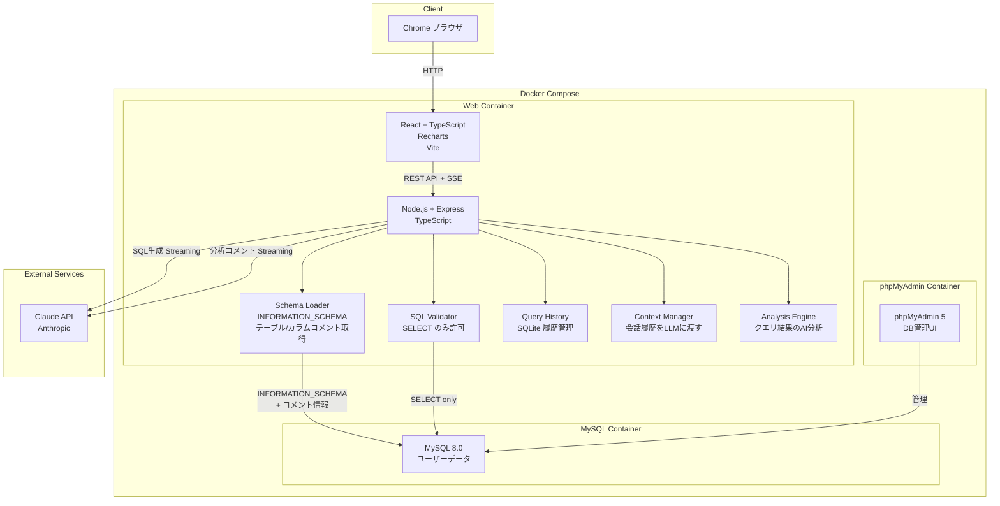
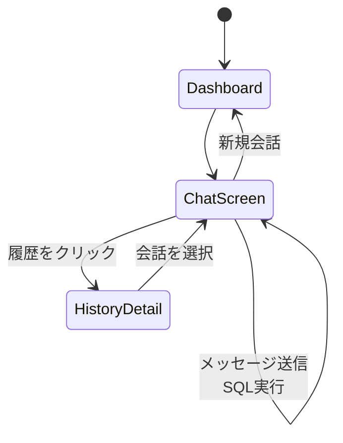
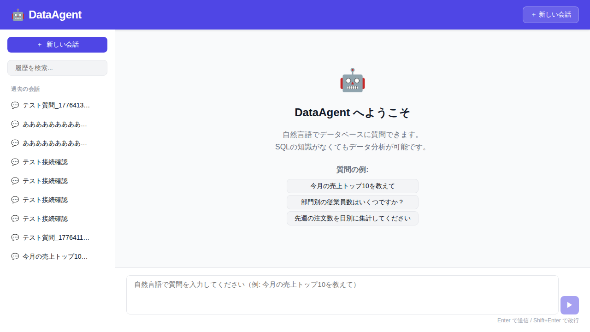
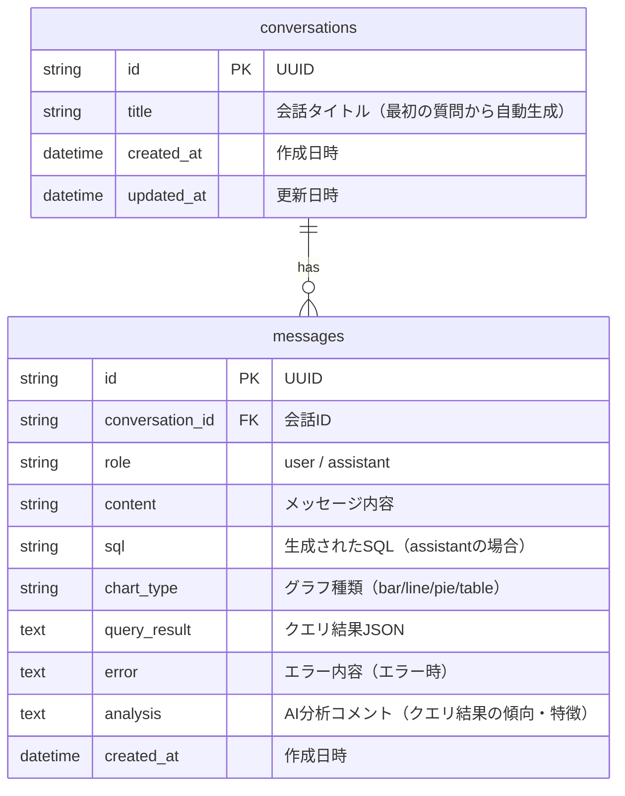

# DataAgent

## 概要

DataAgentは、自然言語でデータベースに問い合わせ、SQLを自動生成してグラフやテーブルで可視化するシステムです。Databricks Genieのような使いやすいデータ分析インターフェースを提供し、ITリテラシーの高低に関わらず誰でも簡単にデータ分析が可能です。

## 達成目標

- 自然言語でのチャット形式のデータベース問い合わせ
- Claude APIによるSQL自動生成
- SQLの透明性確保（生成されたSQLを表示）
- SELECTクエリのみの読み取り専用実行
- クエリ結果の自動可視化（棒グラフ、折れ線グラフ、円グラフ、テーブル）
- LLMによるグラフ種類の自動判定
- クエリ履歴の保存・再利用
- ストリーミング応答による快適なUI体験
- 会話コンテキスト維持による複雑なクエリへの対応
- AI分析コメント（データの傾向・特徴の自動分析）

## システム構成



## 画面フロー



## 画面詳細

### ダッシュボード

- **URL**: `/`



#### UI要素

| 要素 | 挙動 | 説明 |
|------|------|------|
| 新しい会話ボタン | クリックで新規チャット開始 | チャット画面へ遷移 |
| 過去の会話リスト | クリックで会話詳細表示 | 左サイドバーに過去の質問・結果を一覧表示 |
| 履歴検索バー | テキスト入力 | キーワードで過去の会話を検索 |
| チャット入力エリア | テキスト入力 | 自然言語で質問を入力 |
| メッセージ送信ボタン | クリックで送信 | Enterキーまたはボタンで送信 |

#### 画面遷移条件

- 「新しい会話」ボタンをクリック → 新規チャット開始
- 左サイドバーの過去の会話をクリック → その会話の詳細を表示
- チャット入力して送信 → SQLが生成・実行され、結果がグラフ/テーブルで表示

### チャット画面

#### UI要素

| 要素 | 挙動 | 説明 |
|------|------|------|
| ユーザーメッセージ | 表示のみ | 自然言語の入力が表示 |
| AI応答テキスト | ストリーミング表示 | LLMの応答が逐次表示される |
| 生成SQL | 表示のみ | SELECT文として SQL Validator でチェック済み |
| グラフ/テーブル | インタラクティブ | Rechartsによる動的グラフ描画 |
| AI分析コメント | ストリーミング表示 | クエリ結果の傾向・特徴を自動分析 |

#### データベース連携

| 要素 | DB対応（テーブル.カラム） |
|------|--------------------------|
| ユーザーデータ | 接続先DBのテーブル（外部） |
| クエリ履歴 | messages.sql（SQLite） |
| クエリ結果 | messages.query_result（SQLite） |
| 分析コメント | messages.analysis（SQLite） |

## ER図



## ディレクトリ構成

```
output_system/
├── frontend/                 # React フロントエンド
│   ├── src/
│   │   ├── components/       # UI コンポーネント
│   │   │   ├── Chat/         # チャット関連
│   │   │   ├── Chart/        # グラフ描画
│   │   │   ├── History/      # 履歴表示
│   │   │   └── Layout/       # レイアウト
│   │   ├── pages/            # ページコンポーネント
│   │   ├── services/         # APIクライアント
│   │   ├── hooks/            # カスタムフック
│   │   ├── styles/           # グローバルCSS
│   │   ├── types/            # TypeScript型定義
│   │   ├── App.tsx           # アプリケーションルート
│   │   └── main.tsx          # エントリーポイント
│   ├── package.json
│   ├── vite.config.ts        # Vite設定
│   └── vitest.config.ts      # テスト設定
│
├── backend/                  # Node.js/Express バックエンド
│   ├── src/
│   │   ├── routes/           # APIエンドポイント
│   │   │   ├── chat.ts       # チャットエンドポイント
│   │   │   ├── history.ts    # 履歴取得エンドポイント
│   │   │   └── schema.ts     # スキーマ取得エンドポイント
│   │   ├── services/         # ビジネスロジック
│   │   │   ├── llm.ts        # Claude API連携
│   │   │   ├── database.ts   # データベース操作
│   │   │   ├── schema.ts     # スキーマ取得
│   │   │   ├── sqlValidator.ts  # SQL検証
│   │   │   └── historyDb.ts  # SQLite操作
│   │   ├── utils/            # ユーティリティ
│   │   └── index.ts          # サーバーエントリーポイント
│   ├── package.json
│   ├── tsconfig.json
│   └── vitest.config.ts      # テスト設定
│
├── mysql-init/               # MySQL初期化スクリプト
│   └── init.sql              # テーブル定義・サンプルデータ
│
├── test/                     # Playwright E2Eテスト
│   ├── e2e/
│   │   ├── chat.spec.ts      # チャット機能テスト
│   │   ├── history.spec.ts   # 履歴機能テスト
│   │   └── visualization.spec.ts  # グラフ表示テスト
│   └── playwright.config.ts   # Playwright設定
│
├── docker-compose.yml        # Docker Compose設定
├── Dockerfile                # コンテナビルド定義
├── package.json              # ワークスペースパッケージ定義
└── .env                      # 環境変数（ローカル開発用）
```

## WebAPIエンドポイント一覧

| メソッド | パス | 説明 |
|---------|------|------|
| POST | /api/chat | 自然言語でクエリを送信し、SQL生成・実行・結果を取得（SSE） |
| GET | /api/history | 会話履歴一覧を取得 |
| GET | /api/history/:id | 特定の会話の詳細を取得 |
| DELETE | /api/history/:id | 特定の会話を削除 |
| GET | /api/schema | 接続先DBのスキーマ情報を取得 |

詳細は [openapi.yaml](./output_system/openapi.yaml) を参照。

## 起動方法

### 前提条件

- Docker & Docker Compose がインストール済み
- Claude API キーを取得済み（Anthropic コンソール）
- MySQL接続可能なデータベースを準備

### セットアップ手順

1. **リポジトリをクローン**
   ```bash
   git clone <repository-url>
   cd <repository-name>/output_system
   ```

2. **環境変数を設定**
   ```bash
   cp .env.example .env
   # .env を編集し、以下の値を設定:
   # - CLAUDE_API_KEY: Claude API キー
   # - DB_HOST: MySQL ホスト名
   # - DB_PORT: MySQL ポート（デフォルト: 3306）
   # - DB_USER: MySQL ユーザー名
   # - DB_PASSWORD: MySQL パスワード
   # - DB_NAME: データベース名
   ```

3. **コンテナを起動**
   ```bash
   docker compose up -d
   ```

4. **コンテナが起動したことを確認**
   ```bash
   docker compose ps
   ```

### アクセスURL

- **フロントエンド（DataAgent）**: http://localhost:3001
- **バックエンド（API）**: http://localhost:3002
- **phpMyAdmin（DB管理）**: http://localhost:8080

### 停止・削除

```bash
# コンテナを停止
docker compose stop

# コンテナを削除
docker compose down

# ボリュームも削除（データベースがリセットされます）
docker compose down -v
```

## 技術スタック

| レイヤー | 技術 | 備考 |
|---------|------|------|
| フロントエンド | React 18+, TypeScript, Vite | SPA構成 |
| UIコンポーネント | Recharts, グローバルCSS | グラフ描画 + テーブル表示 |
| バックエンド | Node.js 20+, Express, TypeScript | REST API + SSE |
| DB接続 | knex.js | PostgreSQL/MySQL 抽象化 |
| LLM連携 | @anthropic-ai/sdk | Claude API公式SDK。SQL生成+分析コメントの2回呼び出し |
| クエリ履歴 | SQLite (better-sqlite3, WAL mode) | 会話・メッセージの永続化。LLMへの会話コンテキスト提供にも使用 |
| ユーザーDB | MySQL 8.0 | Docker Compose内で起動。テーブル/カラムコメント対応 |
| DB管理 | phpMyAdmin 5 | MySQL管理UI。ポート8080 |
| テスト | Playwright, Vitest | E2Eテスト + ユニットテスト |
| コンテナ | Docker Compose | web + MySQL + phpMyAdmin の3コンテナ構成 |

## 主な機能

### 1. 自然言語によるデータ分析

チャット形式で自然言語で質問を入力すると、Claude APIが自動的にSQLを生成し、データベースから結果を取得します。

```
ユーザー: "今月の売上トップ10を教えて"
↓
DataAgent: SQLを自動生成 → 実行 → グラフで表示
```

### 2. SQL の透明性確保

生成されたSQLがユーザーに表示されるため、実際に何が実行されているかが一目瞭然です。不正なクエリがないか確認できます。

### 3. データの自動可視化

クエリ結果に応じて、LLMが最適なグラフ種類（棒グラフ、折れ線グラフ、円グラフ）を自動判定します。複数の値でない場合はテーブル表示します。

### 4. AI 分析コメント

クエリ結果の傾向や特徴を自動分析し、ユーザーに提供します。「今月の売上はxx円で、前月比yy%増加」のような説明が自動生成されます。

### 5. クエリ履歴の保存

過去の質問と結果が自動保存されるため、何度も同じ質問をする必要がありません。左サイドバーから過去の会話を選択すれば、その会話内容がそのまま復元されます。

### 6. 会話コンテキスト維持

同一会話内の過去のやり取り（生成SQL含む）をLLMに渡すため、「直前のクエリをこう修正して」のような相対的な指示に対応できます。

## セキュリティ

- **SQLインジェクション対策**: 生成されたSQLをバリデーション。SELECTクエリのみ許可
- **読み取り専用**: データベースユーザーに読み取り専用権限を付与
- **認証なし**: 社内利用のため、ネットワーク隔離で運用
- **API キーの管理**: Claude APIキーは環境変数で管理

## トラブルシューティング

### コンテナが起動しない場合

```bash
# ログを確認
docker compose logs web
docker compose logs mysql

# 特定のコンテナを再起動
docker compose restart web
```

### データベースに接続できない場合

```bash
# .env の設定を確認
# - DB_HOST、DB_PORT、DB_USER、DB_PASSWORD、DB_NAME が正しいか確認
# - MySQL コンテナが起動しているか確認: docker compose ps

# phpMyAdminで確認
# http://localhost:8080 で MySQL に接続できるか試す
```

### SQL実行時にエラーが出る場合

- チャット画面にエラーメッセージが表示されます
- 「再試行」ボタンをクリックして、別の表現で質問し直すことができます
- 詳細は生成されたSQLをphpMyAdminで直接実行して確認できます

## ライセンス

UNLICENSED
