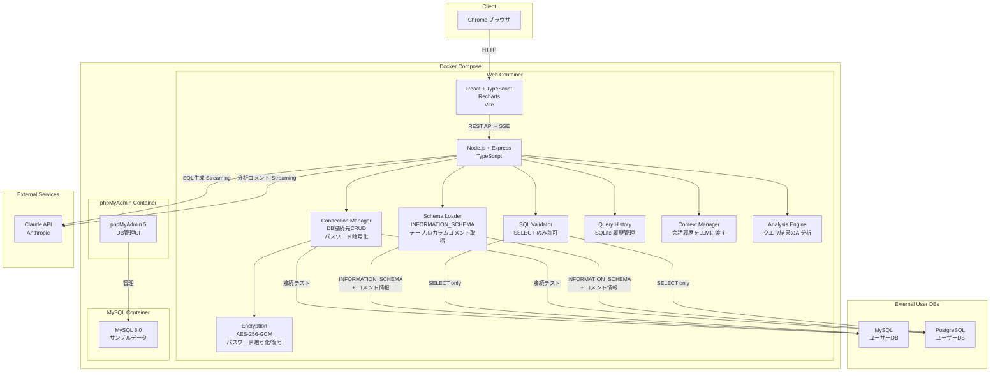
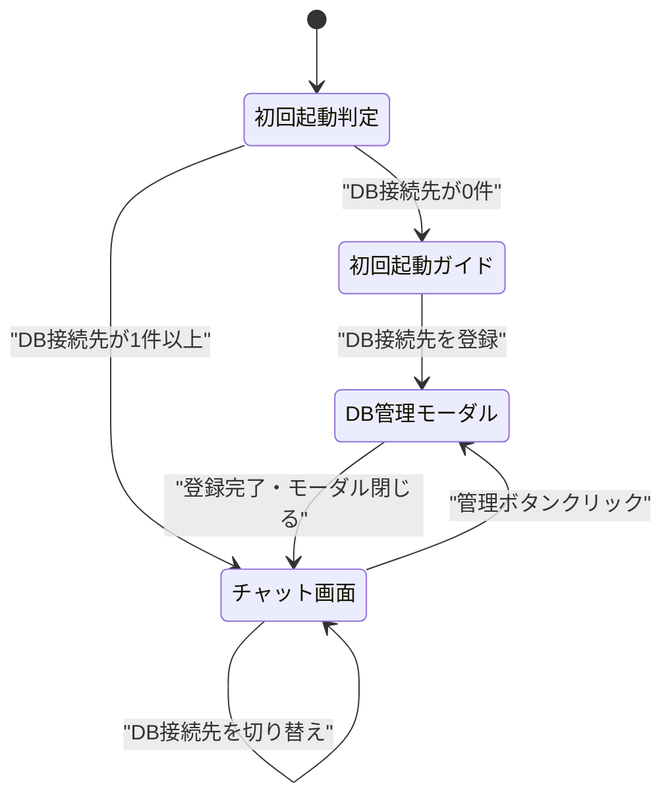
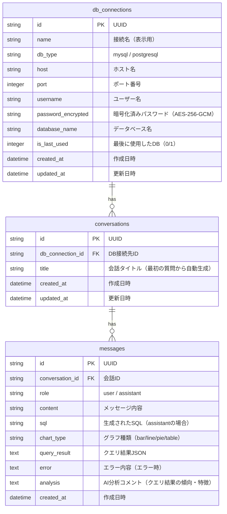

# DataAgent - 自然言語データ分析システム

## 概要

DataAgentは、Databricks Genieのような自然言語データ分析システムです。チャット形式で自然言語の質問を入力すると、Claude APIを使用してSQLを自動生成・実行し、結果をグラフやテーブルで可視化します。

今回の改修では、固定されたDB接続先から複数DB接続先を動的に管理できる機能を追加しました。ユーザーは画面からDB接続先（MySQL/PostgreSQL）を登録・編集・削除でき、ヘッダーのドロップダウンから簡単に切り替えられます。

## 達成目標

### 既存機能（改修前から実装済み）

1. **自然言語チャット入力**: チャット形式のUIで自然言語の質問を入力
2. **SQL自動生成**: Claude API（Anthropic）を使用して自然言語からSQLを自動生成
3. **SQL表示**: 生成されたSQLをユーザーに表示（透明性確保）
4. **SQL実行**: SELECTクエリのみ実行可能（読み取り専用）
5. **結果可視化**: クエリ結果を棒グラフ、折れ線グラフ、円グラフ、テーブルで表示
6. **グラフ種類自動判定**: LLMがデータ特性から最適なグラフ種類を自動提案
7. **クエリ履歴**: 過去の質問と結果を保存・再利用可能
8. **ストリーミング応答**: ChatGPTのように応答が逐次表示される
9. **スキーマ自動取得**: DB接続時にINFORMATION_SCHEMAからテーブル・カラム情報を自動取得
10. **エラーハンドリング**: 不正SQL生成時はエラー表示+再試行ガイドを提示
11. **AI分析コメント**: クエリ結果に対してLLMがデータの傾向・特徴・注目ポイントを自動分析
12. **会話コンテキスト維持**: 同一会話内の過去やり取りをLLMに渡し、修正依頼に対応

### 改修で追加した新機能

13. **複数DB接続先管理**: 画面からDB接続先（接続名、ホスト、ポート、ユーザー名、パスワード、DB名、DB種別）を登録・編集・削除可能
14. **DB接続先選択**: ヘッダーのドロップダウンからDB接続先を切り替え可能
15. **DB切替による会話分離**: DB接続先ごとに会話履歴が分離される
16. **接続中DB表示**: ヘッダーのDB選択ドロップダウンに現在接続中のDB名を常時表示
17. **DB接続テスト**: DB接続先登録・編集時に接続可否を確認可能
18. **DB管理モーダル**: DB選択ドロップダウンの「管理」ボタンからCRUD操作可能
19. **初回起動ガイド**: DB接続先が未登録の場合、ウェルカム画面を表示
20. **デフォルトDB選択**: アプリ起動時、最後に使用したDB接続先を自動選択
21. **パスワード暗号化**: DB接続先のパスワードはAES-256-GCMで暗号化してSQLiteに保存
22. **スキーマキャッシュ**: DB選択時にスキーマ情報を取得しキャッシュ

## システム構成



## 画面フロー



## 画面詳細

### チャット画面（/）

**メイン画面。ユーザーがDB接続先を選択し、自然言語で質問を入力して、AI生成SQLの結果をグラフ/テーブルで確認する画面。**

#### UI要素

| 要素 | 挙動 | 説明 |
|------|------|------|
| DataAgent ロゴ | クリック | トップページへ遷移（同じページ） |
| DB選択ドロップダウン | 選択変更 | 接続先を切り替え、サイドバーの履歴を更新 |
| 管理ボタン | クリック | DB管理モーダルを開く |
| 新しい会話ボタン | クリック | 新規会話を開始（現在の会話は履歴に保存） |
| サイドバー「検索ボックス」 | テキスト入力 | 現在のDB接続先の会話履歴を絞り込み検索 |
| サイドバー「履歴リスト」 | クリック | 過去の会話を切り替え、チャットエリアにメッセージを再表示 |
| チャットエリア「ユーザーメッセージ」 | テキスト表示 | 自然言語で入力した質問 |
| チャットエリア「アシスタントメッセージ」 | テキスト表示 | Claude が生成した説明 |
| SQL表示ブロック | テキスト表示 | 生成されたSELECT文。シンタックスハイライト付き |
| グラフ表示エリア | グラフ表示 | 棒グラフ、折れ線グラフ、円グラフ、またはテーブル |
| AI分析コメント | テキスト表示 | クエリ結果の傾向・特徴・注目ポイントを分析したコメント |
| 入力フィールド | テキスト入力 | 自然言語の質問を入力。Enter で送信 |
| 送信ボタン | クリック | メッセージを送信 |
| ローディング表示 | 回転アニメーション | LLM API待機中 |

#### 画面遷移条件

- **DB接続先を切り替え**: ドロップダウンで別の接続先を選択すると、サイドバーの履歴が選択中DBの会話のみに更新される。現在のチャットエリアはクリアされる
- **新しい会話を開始**: 「新しい会話」ボタンクリックで、チャットエリアがクリアされて新規会話が開始される。前の会話は履歴に保存される
- **過去の会話を復元**: サイドバーの履歴をクリックすると、その会話の全メッセージがチャットエリアに表示される
- **DB管理モーダル**: 「管理」ボタンクリックでモーダルダイアログが表示される

### DB管理モーダル（モーダルダイアログ）

**DB接続先のCRUD操作を行うモーダル。接続情報の入力・検証・テストが可能。**

#### UI要素

| 要素 | 挙動 | 説明 |
|------|------|------|
| モーダルタイトル | テキスト表示 | 「DB接続先管理」 |
| 閉じるボタン | クリック | モーダルを閉じる |
| 接続先一覧 | テーブル表示 | 登録済みの全接続先を表示。編集・削除ボタン付き |
| 接続名 | テキスト入力 | 表示用の接続名（例: 本番DB、検証DB） |
| DB種別 | ドロップダウン | MySQLまたはPostgreSQL を選択 |
| ホスト名 | テキスト入力 | DBサーバーのホスト名またはIP |
| ポート番号 | 数値入力 | ポート番号（MySQL デフォルト: 3306、PostgreSQL デフォルト: 5432） |
| ユーザー名 | テキスト入力 | DB接続ユーザー名 |
| パスワード | パスワード入力 | DB接続パスワード（暗号化して保存） |
| データベース名 | テキスト入力 | DB名 |
| 接続テストボタン | クリック | 入力した接続情報でテスト接続。成功/失敗をトースト通知で表示 |
| 保存ボタン | クリック | 接続情報を登録または更新 |
| 編集ボタン | クリック | 接続先の情報をフォームに読み込んで編集可能にする |
| 削除ボタン | クリック | 接続先と関連する全会話・メッセージを削除 |

#### 画面遷移条件

- **保存成功**: トースト通知「接続先を保存しました」を表示後、自動的にモーダルは開いたまま。接続先一覧が更新される
- **テスト成功**: トースト通知「接続テストに成功しました」
- **テスト失敗**: トースト通知「接続テストに失敗しました: [エラーメッセージ]」
- **モーダルを閉じる**: 変更はSQLiteに保存済みのため、再度モーダルを開いても同じ状態
- **チャット画面に戻る**: モーダルを閉じるとチャット画面に戻る

### 初回起動ガイド（/）

**DB接続先が未登録の場合に表示。ウェルカム画面でDB登録を促す。**

#### UI要素

| 要素 | 挙動 | 説明 |
|------|------|------|
| DataAgent アイコン | 表示 | アプリケーションロゴ |
| ウェルカムタイトル | テキスト表示 | 「DataAgent へようこそ」 |
| ガイドメッセージ | テキスト表示 | 「まずDB接続先を登録してください」 |
| DB接続先を登録するボタン | クリック | DB管理モーダルを開く |

#### 画面遷移条件

- **DB接続先を登録**: ボタンクリックでDB管理モーダルが表示される
- **登録完了**: 最初のDB接続先が登録されると、自動的に初回起動ガイドから チャット画面に切り替わる

## ER図

DataAgent 内部DB（SQLite）のテーブル構成：



## ディレクトリ構成

```
output_system/
├── frontend/                      # React フロントエンド
│   ├── src/
│   │   ├── App.tsx               # メインコンポーネント
│   │   ├── components/           # React コンポーネント
│   │   │   ├── ChatInterface.tsx # チャット画面メインコンポーネント
│   │   │   ├── ChatArea.tsx      # メッセージ表示エリア
│   │   │   ├── InputArea.tsx     # 入力フィールド
│   │   │   ├── Sidebar.tsx       # 左サイドバー（会話履歴）
│   │   │   ├── Header.tsx        # ヘッダー（DB選択ドロップダウン）
│   │   │   ├── DBManagementModal.tsx  # DB管理モーダル
│   │   │   ├── WelcomeScreen.tsx      # 初回起動ガイド
│   │   │   ├── Graph.tsx         # グラフ表示（Recharts）
│   │   │   └── ...
│   │   ├── services/             # API通信
│   │   │   └── api.ts
│   │   ├── styles/               # CSS
│   │   │   └── ...
│   │   └── main.tsx
│   ├── index.html
│   ├── package.json
│   └── vite.config.ts
│
├── backend/                       # Node.js/Express バックエンド
│   ├── src/
│   │   ├── index.ts              # メインサーバー
│   │   ├── routes/               # APIルート
│   │   │   ├── chat.ts           # POST /api/chat (SSE)
│   │   │   ├── history.ts        # GET/DELETE /api/history
│   │   │   ├── schema.ts         # GET /api/schema
│   │   │   └── connections.ts    # GET/POST/PUT/DELETE /api/connections
│   │   ├── services/             # ビジネスロジック
│   │   │   ├── chatService.ts
│   │   │   ├── dbConnectionService.ts
│   │   │   ├── schemaLoader.ts
│   │   │   ├── encryption.ts
│   │   │   ├── sqlValidator.ts
│   │   │   └── ...
│   │   ├── db/                   # データベース
│   │   │   └── sqlite.ts         # SQLite 初期化・マイグレーション
│   │   └── types/                # TypeScript型定義
│   │       └── ...
│   ├── package.json
│   └── tsconfig.json
│
├── test/                          # テスト
│   ├── unit/
│   │   ├── frontend/
│   │   │   └── *.test.tsx
│   │   └── backend/
│   │       └── *.test.ts
│   └── e2e/
│       └── *.spec.ts (Playwright)
│
├── mysql-init/                    # MySQL初期化スクリプト
│   └── init.sql                  # サンプルデータ
│
├── docker-compose.yml             # Docker Compose 定義
├── Dockerfile                     # イメージビルド定義
├── package.json                   # 統合パッケージ設定
├── playwright.config.ts           # Playwright E2Eテスト設定
├── openapi.yaml                   # OpenAPI仕様書
└── .env                          # 環境変数（.gitignoreで管理）
```

## WebAPI エンドポイント一覧

| メソッド | パス | 説明 |
|---------|------|------|
| POST | `/api/chat` | 自然言語でクエリを送信し、SQL生成・実行・結果を取得（SSE） |
| GET | `/api/history` | 会話履歴一覧を取得（db_connection_idフィルター） |
| GET | `/api/history/:id` | 特定の会話の詳細を取得 |
| DELETE | `/api/history/:id` | 特定の会話を削除 |
| GET | `/api/schema` | 接続先DBのスキーマ情報を取得 |
| GET | `/api/connections` | DB接続先一覧を取得 |
| POST | `/api/connections` | DB接続先を登録 |
| PUT | `/api/connections/:id` | DB接続先を更新 |
| DELETE | `/api/connections/:id` | DB接続先を削除（関連会話も削除） |
| POST | `/api/connections/test` | DB接続テスト |

詳細は [openapi.yaml](./output_system/openapi.yaml) を参照。

## 起動方法

### 前提条件

- Docker と Docker Compose がインストール済み
- Node.js 20+ がインストール済み
- `ANTHROPIC_API_KEY` 環境変数を設定（Claude API利用時）

### 起動コマンド

```bash
cd output_system
docker compose up -d
```

### アクセスURL

以下のURLでアプリケーションにアクセス：

- **フロントエンド**: http://localhost:3001
- **バックエンド API**: http://localhost:3002
- **phpMyAdmin** （MySQL管理）: http://localhost:8080

### 環境変数

`.env` ファイルに以下を設定：

```bash
# Claude API キー（必須）
ANTHROPIC_API_KEY=sk-ant-xxxxxxxxxxxx

# DB暗号化キー（AES-256-GCM）
DB_ENCRYPTION_KEY=your-32-byte-hex-key-here

# バックエンドポート
BACKEND_PORT=3002

# データベース設定（Docker Compose で自動管理）
MYSQL_ROOT_PASSWORD=root
MYSQL_USER=dataagent
MYSQL_PASSWORD=dataagent
MYSQL_DATABASE=dataagent
```

## ライセンス

UNLICENSED
