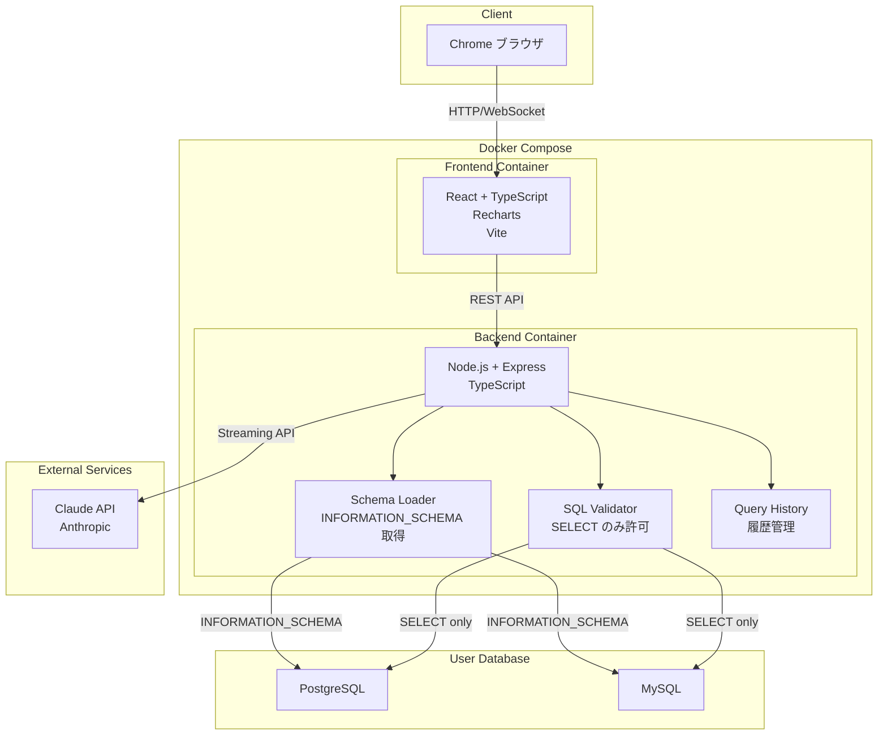
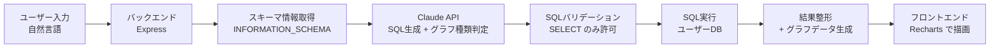

# システム構成図

## アーキテクチャ概要

DataAgentは、フロントエンド（React）、バックエンド（Node.js/Express）、外部LLM（Claude API）、ユーザーDB（PostgreSQL/MySQL）の4層構成。

## データフロー

## 技術スタック詳細

| レイヤー | 技術 | 備考 |
|---------|------|------|
| フロントエンド | React 18+, TypeScript, Vite | SPA構成 |
| UIコンポーネント | Recharts, CSS Modules or Tailwind CSS | グラフ描画 |
| バックエンド | Node.js 20+, Express, TypeScript | REST API + SSE |
| DB接続 | knex.js | PostgreSQL/MySQL 抽象化 |
| LLM連携 | @anthropic-ai/sdk | Claude API公式SDK |
| クエリ履歴 | SQLite (ローカル) | 軽量な履歴保存 |
| コンテナ | Docker Compose | フロントエンド + バックエンド |
