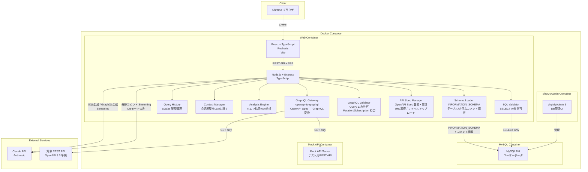
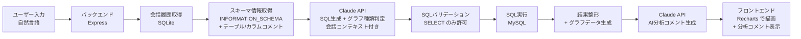
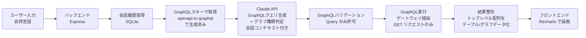

# システム構成図

## アーキテクチャ概要

DataAgentは、フロントエンド（React）、バックエンド（Node.js/Express）、外部LLM（Claude API）、データベース（MySQL + SQLite）の4層構成に、OpenAPI→GraphQLゲートウェイを追加。Docker Compose でフロントエンド・バックエンド・MySQL・phpMyAdmin・モックAPIサーバーを一括起動する。

## データフロー（DBモード - 既存）

## データフロー（APIモード - 新規追加）

## 技術スタック詳細

| レイヤー | 技術 | 備考 |
|---------|------|------|
| フロントエンド | React 18+, TypeScript, Vite | SPA構成 |
| UIコンポーネント | Recharts, グローバルCSS | グラフ描画 + テーブル表示 |
| バックエンド | Node.js 20+, Express, TypeScript | REST API + SSE |
| DB接続 | knex.js | PostgreSQL/MySQL 抽象化 |
| LLM連携 | @anthropic-ai/sdk | Claude API公式SDK。SQL/GraphQL生成+分析コメントの呼び出し |
| OpenAPI→GraphQL変換 | openapi-to-graphql | IBM製、MITライセンス。OpenAPI 3.0 Spec → GraphQLスキーマ変換 |
| クエリ履歴 | SQLite (better-sqlite3, WAL mode) | 会話・メッセージの永続化。LLMへの会話コンテキスト提供にも使用 |
| ユーザーDB | MySQL 8.0 | Docker Compose内で起動。テーブル/カラムコメント対応 |
| DB管理 | phpMyAdmin 5 | MySQL管理UI。ポート8080 |
| モックAPI | Express + OpenAPI Mock | テスト用REST APIサーバー。Docker Compose内で起動 |
| コンテナ | Docker Compose | web + MySQL + phpMyAdmin + mock-api の4コンテナ構成 |
