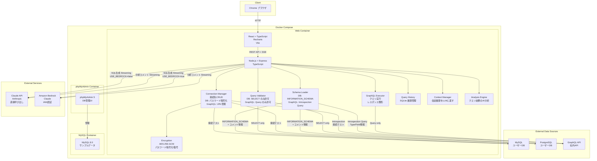
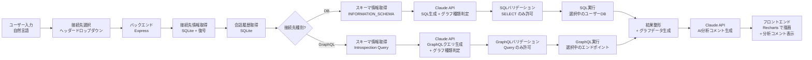

# システム構成図

## アーキテクチャ概要

DataAgentは、フロントエンド（React）、バックエンド（Node.js/Express）、外部LLM（Claude API / Amazon Bedrock）、データソース（ユーザーDB: MySQL/PostgreSQL + GraphQL API + 内部DB: SQLite）の4層構成。Docker Compose でフロントエンド・バックエンド・MySQL・phpMyAdminを一括起動する。AWS ECS Fargate へのデプロイにも対応。

接続先は画面から動的に登録（MySQL/PostgreSQL/GraphQL）。DB接続情報はSQLiteに暗号化保存。GraphQL接続はエンドポイントURLのみ。LLMバックエンドはAnthropic API直接呼び出しとAmazon Bedrock経由を環境変数で切替可能。

## データフロー

## 技術スタック詳細

| レイヤー | 技術 | 備考 |
|---------|------|------|
| フロントエンド | React 18+, TypeScript, Vite | SPA構成 |
| UIコンポーネント | Recharts, グローバルCSS | グラフ描画 + テーブル表示 |
| バックエンド | Node.js 20+, Express, TypeScript | REST API + SSE |
| DB接続 | knex.js | PostgreSQL/MySQL 抽象化。動的接続先切替対応 |
| GraphQL接続 | Node.js fetch（標準API） | Introspection + クエリ実行。追加ライブラリ不要 |
| LLM連携 | @anthropic-ai/sdk, @anthropic-ai/bedrock-sdk | Claude API公式SDK + Bedrock SDK。SQL生成+分析コメントの2回呼び出し。USE_BEDROCK環境変数で切替 |
| クエリ履歴 | SQLite (better-sqlite3, WAL mode) | 会話・メッセージ・DB接続先の永続化 |
| パスワード暗号化 | Node.js crypto (AES-256-GCM) | 追加依存なし。暗号化キーは環境変数で管理 |
| ユーザーDB | MySQL / PostgreSQL（画面から動的登録） | 画面からCRUD可能。接続テスト機能付き |
| GraphQL API | 社内GraphQL API（画面から動的登録） | エンドポイントURLで登録。Introspectionでスキーマ取得 |
| DB管理 | phpMyAdmin 5 | MySQL管理UI。ポート8080 |
| コンテナ | Docker Compose | web + MySQL + phpMyAdmin の3コンテナ構成（変更なし） |
