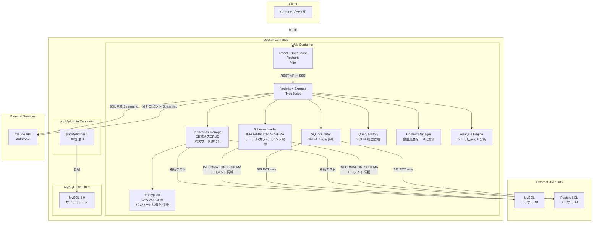

# システム構成図

## アーキテクチャ概要

DataAgentは、フロントエンド（React）、バックエンド（Node.js/Express）、外部LLM（Claude API）、データベース（ユーザーDB: MySQL/PostgreSQL + 内部DB: SQLite）の4層構成。Docker Compose でフロントエンド・バックエンド・MySQL・phpMyAdminを一括起動する。

今回の改修で、ユーザーDBへの接続を.env固定から画面登録による動的切替に変更。接続先情報はSQLiteに暗号化保存。

## データフロー

```mermaid
flowchart LR
    A["ユーザー入力<br>自然言語"] --> A2["DB接続先選択<br>ヘッダードロップダウン"]
    A2 --> B["バックエンド<br>Express"]
    B --> B1["接続先情報取得<br>SQLite + 復号"]
    B1 --> B2["会話履歴取得<br>SQLite"]
    B2 --> C["スキーマ情報取得<br>INFORMATION_SCHEMA<br>+ テーブル/カラムコメント"]
    C --> D["Claude API<br>SQL生成 + グラフ種類判定<br>会話コンテキスト付き"]
    D --> E["SQLバリデーション<br>SELECT のみ許可"]
    E --> F["SQL実行<br>選択中のユーザーDB"]
    F --> G["結果整形<br>+ グラフデータ生成"]
    G --> G2["Claude API<br>AI分析コメント生成"]
    G2 --> H["フロントエンド<br>Recharts で描画<br>+ 分析コメント表示"]
```

## 技術スタック詳細

| レイヤー | 技術 | 備考 |
|---------|------|------|
| フロントエンド | React 18+, TypeScript, Vite | SPA構成 |
| UIコンポーネント | Recharts, グローバルCSS | グラフ描画 + テーブル表示 |
| バックエンド | Node.js 20+, Express, TypeScript | REST API + SSE |
| DB接続 | knex.js | PostgreSQL/MySQL 抽象化。動的接続先切替対応 |
| LLM連携 | @anthropic-ai/sdk | Claude API公式SDK。SQL生成+分析コメントの2回呼び出し |
| クエリ履歴 | SQLite (better-sqlite3, WAL mode) | 会話・メッセージ・DB接続先の永続化 |
| パスワード暗号化 | Node.js crypto (AES-256-GCM) | 追加依存なし。暗号化キーは環境変数で管理 |
| ユーザーDB | MySQL / PostgreSQL（画面から動的登録） | 画面からCRUD可能。接続テスト機能付き |
| DB管理 | phpMyAdmin 5 | MySQL管理UI。ポート8080 |
| コンテナ | Docker Compose | web + MySQL + phpMyAdmin の3コンテナ構成（変更なし） |
