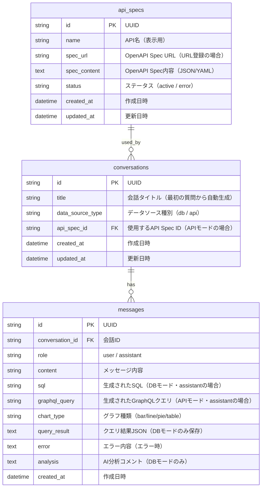

# ER図

## DataAgent 内部DB（クエリ履歴用）

DataAgent自身はSQLiteでクエリ履歴とAPI設定を管理する。ユーザーDBは外部接続のため、ここでは内部DBのみ定義。

## テーブル定義

### conversations テーブル

| カラム | 型 | 制約 | 説明 |
|--------|-----|------|------|
| id | TEXT | PK | UUID |
| title | TEXT | NOT NULL | 会話タイトル |
| data_source_type | TEXT | NOT NULL, DEFAULT 'db' | データソース種別（db / api） |
| api_spec_id | TEXT | FK, NULL | 使用するAPI Spec ID（APIモードの場合） |
| created_at | DATETIME | NOT NULL | 作成日時 |
| updated_at | DATETIME | NOT NULL | 更新日時 |

### messages テーブル

| カラム | 型 | 制約 | 説明 |
|--------|-----|------|------|
| id | TEXT | PK | UUID |
| conversation_id | TEXT | FK, NOT NULL | 会話ID |
| role | TEXT | NOT NULL | user / assistant |
| content | TEXT | NOT NULL | メッセージ内容 |
| sql | TEXT | NULL | 生成されたSQL（DBモード） |
| graphql_query | TEXT | NULL | 生成されたGraphQLクエリ（APIモード） |
| chart_type | TEXT | NULL | グラフ種類 |
| query_result | TEXT | NULL | クエリ結果JSON（DBモードのみ） |
| error | TEXT | NULL | エラー内容 |
| analysis | TEXT | NULL | AI分析コメント（DBモードのみ） |
| created_at | DATETIME | NOT NULL | 作成日時 |

### api_specs テーブル（新規追加）

| カラム | 型 | 制約 | 説明 |
|--------|-----|------|------|
| id | TEXT | PK | UUID |
| name | TEXT | NOT NULL | API名（表示用） |
| spec_url | TEXT | NULL | OpenAPI Spec URL（URL登録の場合） |
| spec_content | TEXT | NOT NULL | OpenAPI Spec内容（JSON/YAML文字列） |
| status | TEXT | NOT NULL, DEFAULT 'active' | ステータス（active / error） |
| created_at | DATETIME | NOT NULL | 作成日時 |
| updated_at | DATETIME | NOT NULL | 更新日時 |
