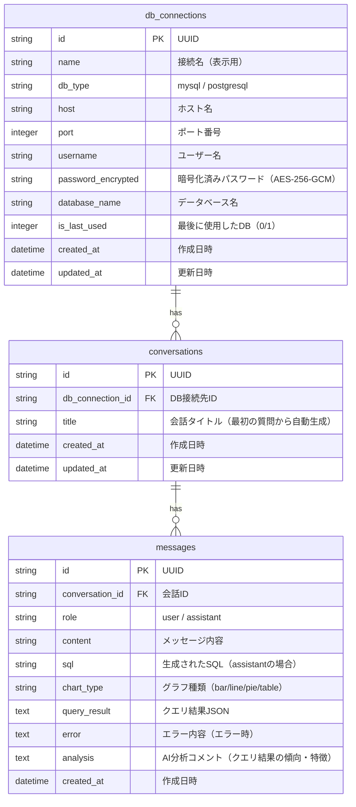

# ER図

## DataAgent 内部DB（SQLite）

DataAgent自身はSQLiteでDB接続先管理・クエリ履歴を管理する。ユーザーDBは外部接続のため、ここでは内部DBのみ定義。

## テーブル定義

### db_connections テーブル（新規追加）

| カラム | 型 | 制約 | 説明 |
|--------|-----|------|------|
| id | TEXT | PK | UUID |
| name | TEXT | NOT NULL, UNIQUE | 接続名（表示用） |
| db_type | TEXT | NOT NULL | mysql / postgresql |
| host | TEXT | NOT NULL | ホスト名 |
| port | INTEGER | NOT NULL | ポート番号 |
| username | TEXT | NOT NULL | ユーザー名 |
| password_encrypted | TEXT | NOT NULL | AES-256-GCM暗号化済みパスワード |
| database_name | TEXT | NOT NULL | データベース名 |
| is_last_used | INTEGER | NOT NULL DEFAULT 0 | 最後に使用したDB（0/1） |
| created_at | DATETIME | NOT NULL | 作成日時 |
| updated_at | DATETIME | NOT NULL | 更新日時 |

### conversations テーブル（変更あり）

| カラム | 型 | 制約 | 説明 |
|--------|-----|------|------|
| id | TEXT | PK | UUID |
| db_connection_id | TEXT | FK, NOT NULL | DB接続先ID（**新規追加**） |
| title | TEXT | NOT NULL | 会話タイトル |
| created_at | DATETIME | NOT NULL | 作成日時 |
| updated_at | DATETIME | NOT NULL | 更新日時 |

### messages テーブル（変更なし）

| カラム | 型 | 制約 | 説明 |
|--------|-----|------|------|
| id | TEXT | PK | UUID |
| conversation_id | TEXT | FK, NOT NULL | 会話ID |
| role | TEXT | NOT NULL | user / assistant |
| content | TEXT | NOT NULL | メッセージ内容 |
| sql | TEXT | NULL | 生成されたSQL |
| chart_type | TEXT | NULL | グラフ種類 |
| query_result | TEXT | NULL | クエリ結果JSON |
| error | TEXT | NULL | エラー内容 |
| analysis | TEXT | NULL | AI分析コメント |
| created_at | DATETIME | NOT NULL | 作成日時 |

## マイグレーション方針

- 既存のSQLiteデータベースは**再作成**する（既存の会話履歴は破棄許可済み）
- db_connectionsテーブルを新規作成
- conversationsテーブルにdb_connection_idカラムを追加
- 外部キー制約: `conversations.db_connection_id` → `db_connections.id` (ON DELETE CASCADE)
