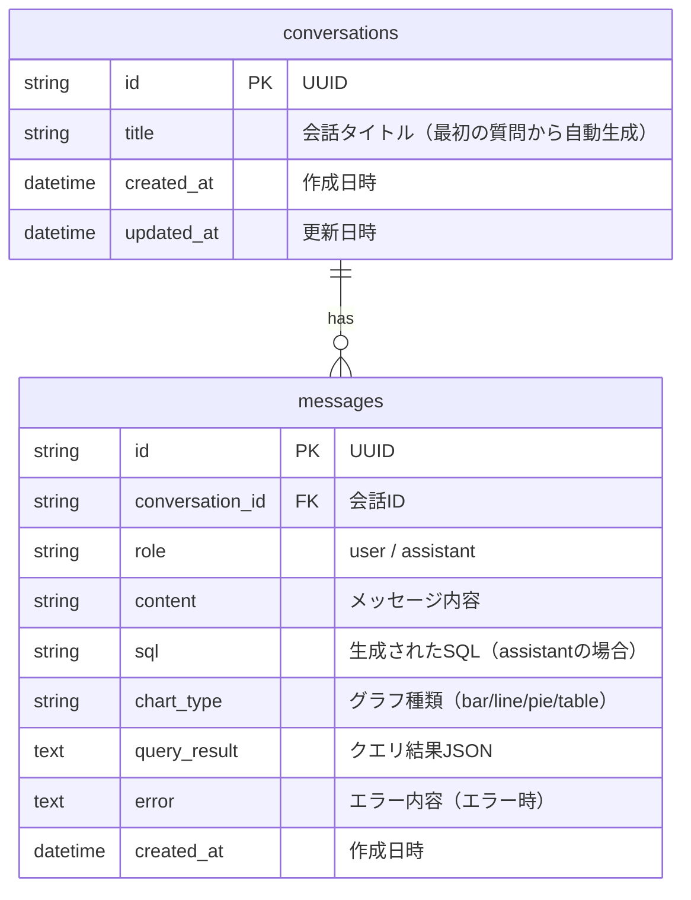

# ER図

## DataAgent 内部DB（クエリ履歴用）

DataAgent自身はSQLiteでクエリ履歴を管理する。ユーザーDBは外部接続のため、ここでは内部DBのみ定義。

## テーブル定義

### conversations テーブル

| カラム | 型 | 制約 | 説明 |
|--------|-----|------|------|
| id | TEXT | PK | UUID |
| title | TEXT | NOT NULL | 会話タイトル |
| created_at | DATETIME | NOT NULL | 作成日時 |
| updated_at | DATETIME | NOT NULL | 更新日時 |

### messages テーブル

| カラム | 型 | 制約 | 説明 |
|--------|-----|------|------|
| id | TEXT | PK | UUID |
| conversation_id | TEXT | FK, NOT NULL | 会話ID |
| role | TEXT | NOT NULL | user / assistant |
| content | TEXT | NOT NULL | メッセージ内容 |
| sql | TEXT | NULL | 生成されたSQL |
| chart_type | TEXT | NULL | グラフ種類 |
| query_result | TEXT | NULL | クエリ結果JSON |
| error | TEXT | NULL | エラー内容 |
| created_at | DATETIME | NOT NULL | 作成日時 |
