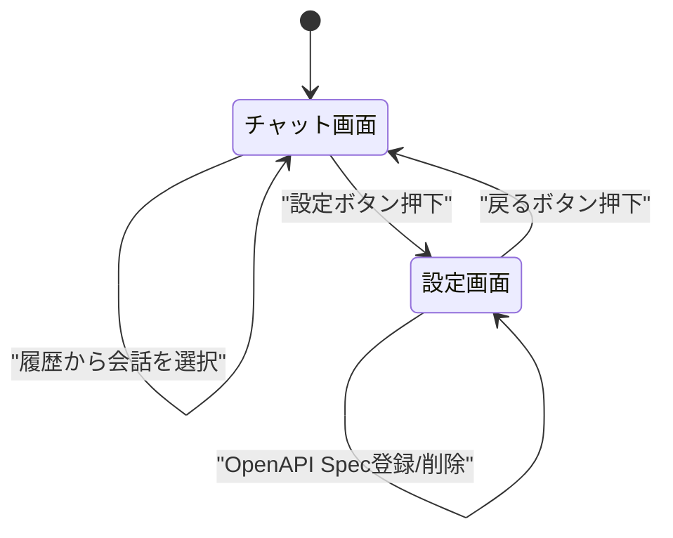
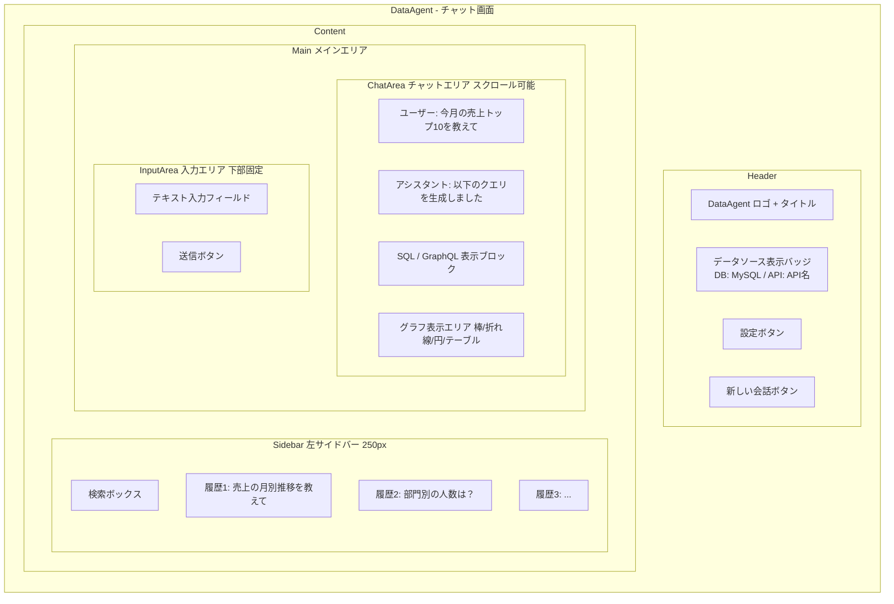
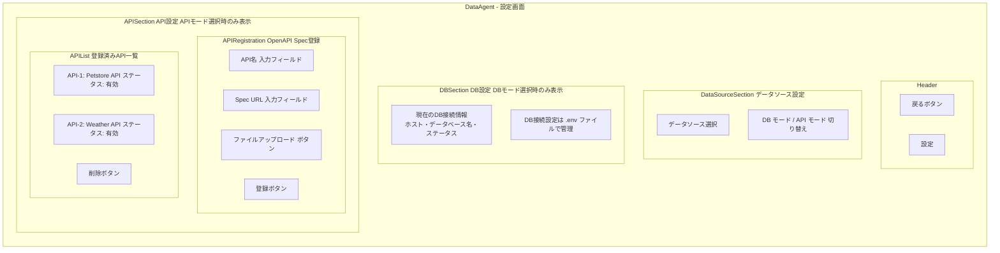

# 画面一覧・遷移図

## 画面一覧

| # | 画面名 | パス | 説明 |
|---|--------|------|------|
| 1 | チャット画面 | / | メイン画面。サイドバー（履歴）+ チャットエリア + グラフ表示 |
| 2 | 設定画面 | /settings | データソース切り替え、OpenAPI Spec登録・管理 |

## 画面遷移図

## ワイヤーフレーム

### チャット画面

### 設定画面

### UI要素の詳細

| 要素 | 説明 | 備考 |
|------|------|------|
| サイドバー | クエリ履歴一覧。クリックで会話を切り替え | 幅250px程度。折りたたみ可能 |
| チャットエリア | メッセージの表示領域 | スクロール可能。最新メッセージが下に表示 |
| SQL/GraphQL表示ブロック | 生成されたクエリをコードブロックで表示 | シンタックスハイライト付き。DBモード→SQL、APIモード→GraphQL |
| グラフ表示エリア | Rechartsで描画されたグラフ | LLMが自動選択した種類で表示 |
| 入力フィールド | 自然言語で質問を入力 | Enter で送信。Shift+Enter で改行 |
| 新しい会話ボタン | 新規会話を開始 | 現在の会話は履歴に保存 |
| データソース表示バッジ | 現在のデータソースをヘッダーに表示 | DB: MySQL / API: API名 |
| 設定ボタン | 設定画面への遷移 | ヘッダー右上に配置 |
| エラー表示 | クエリ実行エラー時のメッセージ | 「質問を変えてみてください」等のガイド付き |
| ローディング | LLM応答待ち中の表示 | ストリーミングで逐次表示 |
| OpenAPI Spec登録フォーム | URL入力またはファイルアップロード | OpenAPI 3.0のみ対応 |
| 登録済みAPI一覧 | 複数登録されたAPIの管理 | 選択・削除が可能 |
