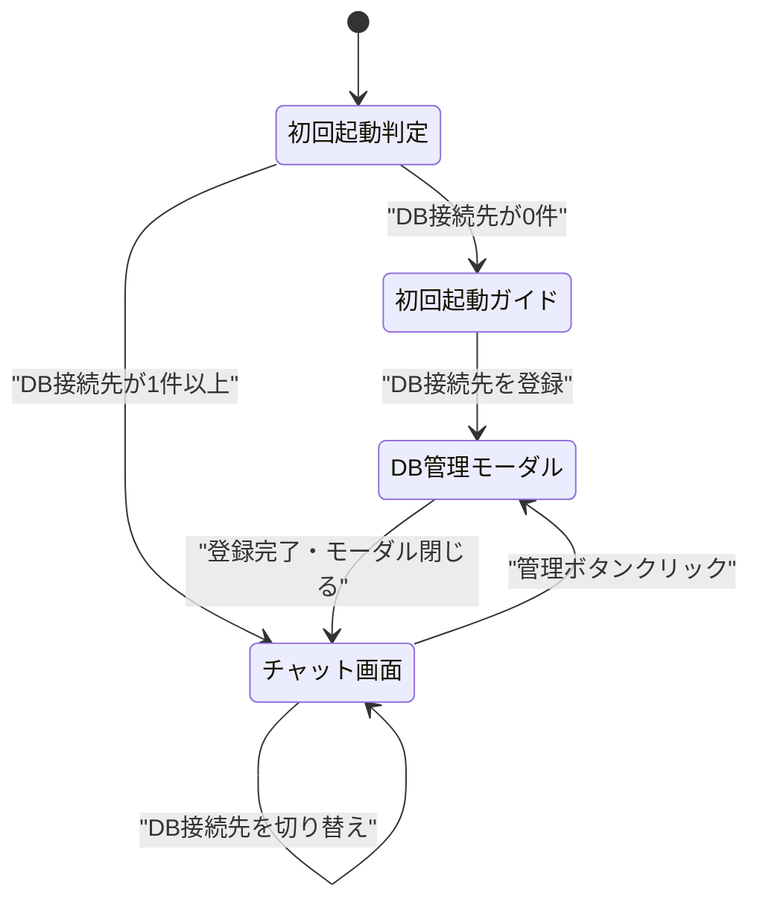
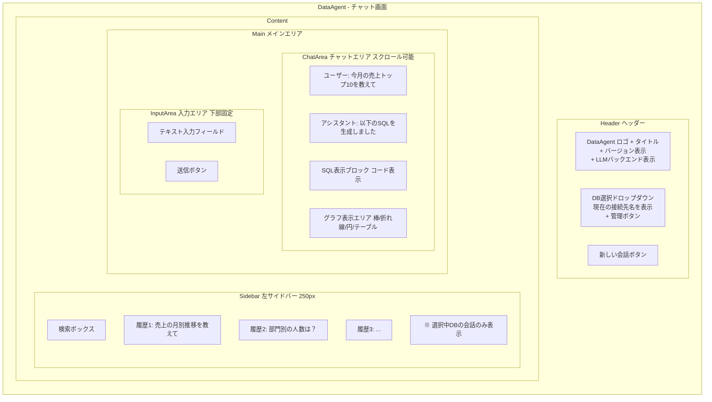
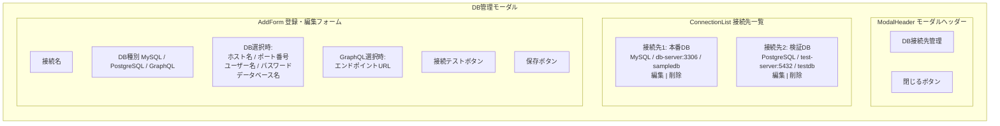
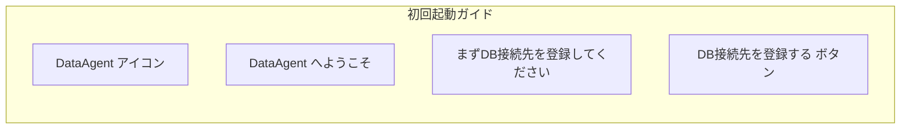

# 画面一覧・遷移図

## 画面一覧

| # | 画面名 | パス | 説明 |
|---|--------|------|------|
| 1 | チャット画面 | / | メイン画面。ヘッダー（DB選択）+ サイドバー（履歴）+ チャットエリア + グラフ表示 |
| 2 | DB管理モーダル | （モーダル） | DB接続先の登録・編集・削除。接続テスト機能付き |
| 3 | 初回起動ガイド | / | DB接続先未登録時に表示。DB登録を促すウェルカム画面 |

## 画面遷移図

## ワイヤーフレーム

### チャット画面

### DB管理モーダル

### 初回起動ガイド

### UI要素の詳細

| 要素 | 説明 | 備考 |
|------|------|------|
| 接続先選択ドロップダウン | ヘッダーに配置。接続先名一覧 + 「管理」ボタン | `接続名 (mysql)` / `接続名 (graphql)` 形式で表示 |
| 接続先管理モーダル | 接続先のCRUD操作 | ドロップダウンの「管理」ボタンからアクセス |
| 接続テストボタン | DB: 接続試行、GraphQL: Introspection Query | 成功/失敗をトースト通知で表示 |
| サイドバー | 選択中DBの会話履歴一覧。クリックで会話を切り替え | 幅250px程度。折りたたみ可能 |
| チャットエリア | メッセージの表示領域 | スクロール可能。最新メッセージが下に表示 |
| SQL表示ブロック | 生成されたSQLをコードブロックで表示 | シンタックスハイライト付き |
| グラフ表示エリア | Rechartsで描画されたグラフ | LLMが自動選択した種類で表示 |
| バージョン表示 | gitハッシュ+ビルド日付のバージョン文字列 | ヘッダーのタイトル横に小さく表示 |
| LLMバックエンド表示 | 使用中のLLMバックエンド+モデル名のバッジ | 「Anthropic API / claude-sonnet-4-20250514」等 |
| 入力フィールド | 自然言語で質問を入力 | Shift+Enter で送信。Enter で改行 |
| 新しい会話ボタン | 新規会話を開始 | 現在の会話は履歴に保存 |
| エラー表示 | SQL実行エラー時のメッセージ | 「質問を変えてみてください」等のガイド付き |
| ローディング | LLM応答待ち中の表示 | ストリーミングで逐次表示 |
| 初回起動ガイド | DB接続先未登録時のウェルカム画面 | 「DB接続先を登録する」ボタンでモーダルを開く |
